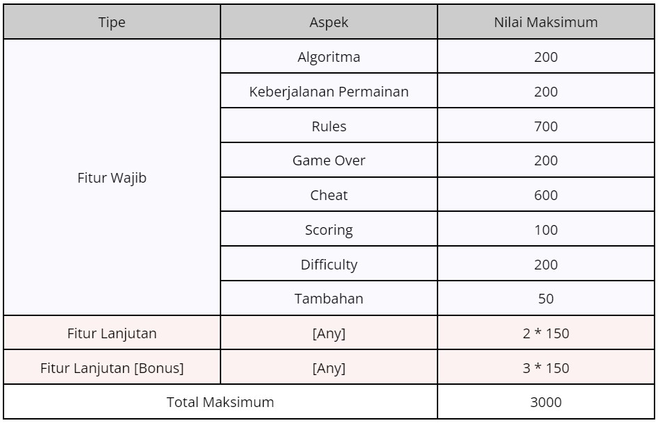

# The Password Game
> Task Seleksi Lab IRK created by bewe

versi 9 Juli 2024

## 💡 Latar Belakang
Dalam era digital saat ini, keamanan informasi pribadi semakin menjadi perhatian utama. Salah satu aspek penting dalam menjaga keamanan informasi adalah menggunakan kata sandi yang kuat dan sulit ditebak. Demi mengedukasi dan menghibur penggunanya sekaligus, "Password Game" hadir sebagai solusi yang menarik. Game ini menantang pemain untuk membuat atau menentukan kata sandi yang rumit sesuai dengan ketentuan yang diminta. Namun, game ini masih memiliki beberapa kekurangan dan memiliki potensi yang besar untuk dikembangkan. Beberapa aspek yang harus ditangani adalah seperti kurangnya keanekaragaman kata sandi, waktu tunggu yang tidak efektif, ketidakjelasan petunjuk dan feedback, pengembangan sistem skor dan peringkat yang kurang komprehensif, tampilan yang kurang menarik, dan masih banyak lagi.

 
  <b>Fig 1.</b> Contoh permainan "Password Game" dari <a href="https://neal.fun/password-game/">https://neal.fun/password-game/</a> 
 

 

## 📝 Spesifikasi Tugas
Sebelum mulai mengerjakan, sangat direkomendasikan untuk mencoba dan memahami permainannya terlebih dahulu pada link yang terlampir di bawah ini: https://neal.fun/password-game/ .

Dalam tugas besar ini, Anda diminta untuk membuat sebuah game yang mirip dengan “Password Game” berbentuk website. Anda harus mengerjakan semua poin fitur wajib (8) dan minimal 2 fitur lanjutan. Jika anda mengerjakan lebih dari 2 fitur lanjutan, maka fitur-fitur tersebut akan dihitung sebagai bonus. Maksimal fitur lanjutan yang dapat dihitung adalah 5 fitur lanjutan.

### Fitur Wajib (2250 Poin)
1. Algoritma yang digunakan untuk pencocokan pola string adalah regex, Knuth-Morris-Pratt (KMP), dan Boyer-Moore (BM).  
Catatan: Program memiliki toggle button, dapat memilih antara algoritma KMP atau BM untuk pencocokan string. 

2. Seperti dengan cara kerja game aslinya, rule yang diminta untuk membentuk sebuah password akan bertambah satu-persatu seiring dengan password yang sudah sesuai dengan rule (misal rule 1 sudah terpenuhi, maka rule 2 akan muncul, dan seterusnya, dengan catatan rule 1 masih berlaku). Jika password tidak sesuai dengan rules yang berlaku, tampilkan pesan bahwa rule tersebut salah. Tampilkan juga letak kesalahan password ketika password tidak sesuai dengan rule yang ada (seperti gambar Fig 1, huruf atau angka yang salah diberi highlight berwarna merah).

3. Berikut adalah daftar rule yang harus diimplementasikan (harus secara urut):
    - Rule 1 – Your password must be at least <b><i>X</i></b> characters
    - Rule 2 – Your password must include a number
    - Rule 3 – Your password must include an uppercase letter
    - Rule 4 – Your password must include a special character
    - Rule 5 – The digits in your password must add up to <b><i>X</i></b>
    - Rule 6 – Your password must include a month of the year
    - Rule 7 – Your password must include a Roman numeral
    - Rule 8 – Your password must include one of this country  
    (Anda harus mencari minimal 10 gambar bendera negara. Tampilkan <b><i>X</i></b> bendera saja pada 1 sesi permainan)
    - Rule 9 – The Roman numerals in your password should multiply to <b><i>X</i></b>
    - Rule 10 – Oh no! Your password is on fire 🔥. Quick, put it out!  
    (Emoji api akan “membakar” 1 huruf (menghapus huruf dan menggantikannya dengan emoji api) setiap <b><i>X</i></b> detik dimulai dari huruf terakhir. Api tidak akan berhenti membakar sampai semua emoji api pada textfield sudah dihapus. Perlu diperhatikan bahwa api dapat secara random muncul kembali kapanpun dan pemain perlu menghapusnya kembali)
    - Rule 11 – 🥚 This is my chicken Paul. He hasn’t hatched yet. Please put him in your password and keep him safe  
    (Pastikan emoji telur tidak terhapus. Kalau terhapus, pemain dinyatakan kalah)
    - Rule 12 – Your password must include this CAPTCHA  
    (Anda harus mencari minimal 7 gambar CAPTCHA. Tampilkan 1 gambar CAPTCHA saja pada 1 sesi permainan. Gambar CAPTCHA dapat seolah-olah di-refresh untuk mengganti gambar CAPTCHA)
    - Rule 13 – Your password must include a leap year
    - Rule 14 – 🔠Paul has hatched ! Please don’t forget to feed him. He eats <b><i>X</i></b> 🛠every <b><i>Y</i></b> second  
    (Emoji telur dari rule 11 digantikan dengan emoji ayam. Setiap <b><i>X</i></b> detik harus terdapat >= <b><i>Y</i></b> emoji ulat. Jika dalam <b><i>X</i></b> detik tersebut terdapat < <b><i>Y</i></b> ulat, pemain dinyatakan kalah)
    - Rule 15 – A sacrifice must be made. Pick <b><i>X</i></b> letters that you will no longer be able to use
    - Rule 16 – Your password must contain one of the following words: I want IRK | I need IRK | I love IRK
    - Rule 17 – At least <b><i>X</i></b>% of your password must be in digits
    - Rule 18 – Your password must include the length of your password
    - Rule 19 – The length of your password must be a prime number
    - Rule 20 – Your password must include the current time  
    Catatan: Untuk rule dengan jawaban-jawaban eksak seperti gambar bendera dan CAPTCHA, beserta jawabannya harus disimpan di dalam database. Rule-rule lain yang dirasa memerlukan database, juga diperbolehkan untuk menggunakan database. Atribut dan metadatanya dibebaskan, namun, anda tidak diperbolehkan menyimpan gambar dengan nama file path-nya saja seperti pada tubes 3 kemarin, cobalah untuk mengeksplorasi berbagai cara untuk “menyimpan” gambar pada database. 

4. Pemain dapat dinyatakan kalah jika pemain sudah tidak memiliki satupun opsi jawaban atau tidak ada jawaban yang dapat memenuhi ketentuan pada current rule, algoritma pencarian opsi dibebaskan. Selain itu, kondisi kalah juga dapat terjadi pada kasus-kasus unik seperti rule 11 dan rule 14. Sedangkan, pemain dapat dinyatakan menang jika pemain telah memenuhi semua rule (20 rule).

5. Program harus memiliki perintah cheat untuk membenarkan semua rules yang masih salah. Namun, anda juga harus memberikan salah satu opsi jawaban agar semua rules tersebut terpenuhi. Anda dapat menggunakan command tersebut dengan mengetik “cheat” pada textfield, kemudian akan secara otomatis menghapus dan mengganti kata-kata “cheat” tersebut menjadi salah satu opsi jawaban yang tersedia. Jawaban harus melanjutkan password yang telah dibuat pemain pada rules sebelumnya, tidak boleh membuat password dari awal. Namun, jika ternyata sudah tidak ada opsi jawaban yang tersedia, anda diperbolehkan untuk mengganti password dari rule-rule sebelumnya dari rule yang paling tinggi. Misal: rule 18 tidak ada opsi jawaban, maka anda boleh mengganti password pada rule 17. Untuk kasus-kasus unik seperti pada rule 11 dan 14, buatlah agar rule-rule tersebut sudah tidak berlaku lagi, pastikan pemain tidak dapat kalah ketika melanggar rule-rule tersebut. Kemudian untuk rule 10, anda harus menghapus semua emoji api dan memastikan emoji api tidak akan keluar lagi. Metode dan algoritma pencarian jawaban dibebaskan. 

6. Terdapat sistem scoring yang sistem perhitungannya dibebaskan kepada anda. Dapat berdasarkan waktu pengerjaan, kualitas password, atau bahkan kombinasi dari keduanya, dan masih banyak opsi lain. Jika anda menggunakan waktu, pastikan waktu tidak dapat dimanipulasi oleh pengguna secara local. Score tersebut harus ditampilkan sepanjang permainan dan selalu ter-update. Jika pemain sudah dalam kondisi kalah atau menang, tampilkan score final yang didapat, secara bersamaan tampilkan juga highest score yang pernah didapat pemain.

7. Terdapat 3 mode difficulty level yang terdiri dari easy, medium, dan hard. Parameter kesulitannya dibebaskan kepada anda dan dibuat sekreatif mungkin. Namun perbedaan difficulty level harus signifikan dan terasa jelas. Tidak diperbolehkan menghapus rules yang sudah tertera di poin nomor 3, namun boleh ditambahkan dan dimodifikasi (misalnya menambahkan “Your password must include 6 hours after the current time” pada rule 20). Diperbolehkan juga mengubah variabel angka yang ditandai dengan <b><i>X</i></b> dan <b><i>Y</i></b>.

8. Informasi tambahan: 
    - Jangan lupa untuk menampilkan informasi-informasi penting seperti panjang password yang ada di textfield.
    - Mekanisme pencarian pola tidak boleh menggunakan submit button. Cobalah untuk mencari cara agar proses pengecekan selalu up-to-date, dengan tetap memperhatikan dan mempertimbangkan performance dari program kalian.
    - Jika proses pencarian pola dianggap terlalu lama, upaya optimasi sangat direkomendasikan. Metode optimasi yang digunakan sangat dibebaskan kepada anda, tidak harus menggunakan multithreading atau semacamnya. Pastikan bahwa metode optimasi yang digunakan tidak mengurangi kualitas dari program yang dibuat.

### Fitur Lanjutan (max 750 Poin)
1. Menggunakan algoritma tambahan lain selain regex, KMP, dan BM untuk pencocokan pola string. Algoritma tidak harus yang sudah diajarkan pada salinda kuliah. Pastikan bahwa tingkat efisiensi algoritma ini >= algoritma spesifikasi wajib.

2. Pengguna dapat melakukan save dan load game, metode dibebaskan asal semua state pada game disimpan dan dapat di-load. Jangan lupa untuk menyimpan waktu untuk waktu penyelesaian jika anda mengerjakan fitur lanjutan nomor 3.

3. Sebuah sesi permainan akan masuk ke history ketika pemain berhasil memenangkan sesi permainan saat itu. History permainan dapat dilihat kembali walaupun kita sudah berganti session game. Ketika kita melihat sebuah history permainan, kita dapat melihat password yang dibentuk, rules, score, dan waktu yang dibutuhkan untuk menyelesaikan permainan. Pastikan waktu tidak dapat dimanipulasi oleh pengguna secara local.

4. Membuat 7 rules tambahan sekreatif mungkin. Rules yang dibuat harus berbeda dengan rules pada fitur wajib, tidak boleh ada rules yang mirip. Rules yang mirip tidak akan dianggap sebagai rules yang berbeda. Jika mengerjakan fitur ini, artinya kondisi menang adalah ketika pemain telah memenuhi 27 rules.

5. Penggunaan docker untuk backend dan frontend. Pastikan program dapat berjalan dengan baik pada docker.

6. Deployment aplikasi (backend dan frontend) sehingga dapat diakses dan dimainkan pada web. Docker wajib digunakan pada saat deployment jika anda mengerjakan fitur lanjutan nomor 5.

7. Membuat global leaderboard. Global leaderboard akan berisi highest score setiap pemain yang berbeda. 1 device/client dapat dianggap sebagai 1 pemain. Anda juga boleh membedakan pemain dengan menggunakan username atau semacamnya.

8. Membuat sebuah mobile app. Fitur ini dihitung sebanyak 3 fitur lanjutan. Jika sudah mengerjakan fitur ini, tidak perlu lagi mengerjakan versi websitenya.

9. Membuat fitur multiplayer atau 1v1 dengan player lain. Mekanismenya dibebaskan dengan bare minimum setiap pemain dapat melihat progress dan score lawannya secara real-time saat sesi permainan sedang berjalan.  Fitur ini dihitung sebanyak 5 fitur lanjutan.

10. Fitur-fitur dan ide-ide lainnya yang dianggap keren dan kreatif dapat menjadi konsiderasi untuk dijadikan fitur lanjutan. Aku tunggu kreativitas kalian!

## ❓ Hal yang Perlu Diperhatikan
- Tidak ada batasan untuk bahasa atau framework yang dipakai.
- Tampilan program dibebaskan dan dibuat sekreatif mungkin, asal semua fitur dapat diakses dan digunakan. Kreatifitas UI/UX dapat menjadi konsiderasi nilai tambahan.
- Buatlah README untuk dokumentasi pengembangan yang seminimal-minimalnya terdiri dari:     
    - Deskripsi aplikasi
    - Teknologi, bahasa, dan framework yang digunakan
    - Struktur program
    - Penjelasan dan penggunaan algoritma, disertai dengan alasan kenapa menggunakan algoritma tersebut
    - Cara menjalankan program
    - Tangkapan layar setiap halaman yang dibuat beserta deskripsi singkat
    - Referensi belajar
- Akan ada pengurangan poin jika komponen README yang dibuat tidak lengkap
- Jika terdapat kesamaan kode yang signifikan dengan kode orang lain atau kode yang ada di internet, maka akan dikenakan sanksi sesuai dengan kebijakan lab IRK.

## 📂 Pengerjaan dan Pengumpulan
1. Buatlah repositori **private** pada github masing-masing dan invite `bernarduswillson` dalam repositori tersebut.
2. Berkas yang dikumpulkan berupa **link rilis tag ke repositori github** yang telah dibuat dengan ketentuan sebagai berikut.
    - Memberikan tag `vn` pada commit terakhir Anda setiap kali ingin melakukan submisi dengan `n` adalah jumlah submisi yang telah dilakukan. (contoh: `v1` untuk submisi pertama).
    - **Tidak menggunakan *url shortener*** (bit.ly, shortlink, atau yang lain) saat melakukan pengumpulan *task*.
    - Anda dapat melakukan rilis dengan panduan [berikut](https://docs.github.com/en/repositories/releasing-projects-on-github/managing-releases-in-a-repository).
3. **Lakukan submisi** pada website seleksi IRK dengan menggunakan akun std.stei.itb.ac.id, **lakukan konfirmasi** ke LINE `@bwillson03`, dan **jadwalkan demo** dengan cara yang sama. Lakukan hal yang sama jika membuat rilis yang baru.
4. Jika terdapat pertanyaan dapat menghubungi LINE `@bwillson03`.

## 📌 Penilaian

## 📚 Referensi
- https://neal.fun/password-game/
- https://informatika.stei.itb.ac.id/~rinaldi.munir/Stmik/2023-2024/stima23-24.htm#SlideKuliah
- https://www.google.com/

 

**Baca speknya yang teliti guys, banyak constraint soalnya. Goodluck! Jangan lupa tidur yaaa**